# STM32-Quadcopter: Low-cost Quadcopter Design

### Description

[](https://github.com/iNavFlight/inav)
[](https://www.st.com/en/microcontrollers-microprocessors/stm32-32-bit-arm-cortex-mcus.html)
[](https://www.gnu.org/licenses/gpl-3.0)


**[Website](https://www.imroboticslab.com/releases)** | **[Documentation](https://www.imroboticslab.com/docs/stm32-quadcopter)**  | **[Community Discord](https://discord.com/invite/WJuUWsy6DJ)** | **[3D Models & Prints](https://makerworld.com/en/models/1695470-quadcopter-3d-printable-stm32-mcu#profileId-1797658)**

This is a quadcopter design based on the STM32F411CEU Blackpill flight controller. The flight controller is compatible with INAV 6.0 firmware. The flight controller uses an MPU6500 for inertial measurements and a BMP280 for altitude sensing, and also supports an optional GPS and magnetometer module.

The frame is composed mostly of 2D parts cut from carbon-fiber sheets. Alternatively, you can 3D-print parts in carbon-fiber-reinforced filaments (PET-CF, PAHT-CF, PA6-CF, PPS-CF), with less-critical components in ABS.

|  |
| --- |

| 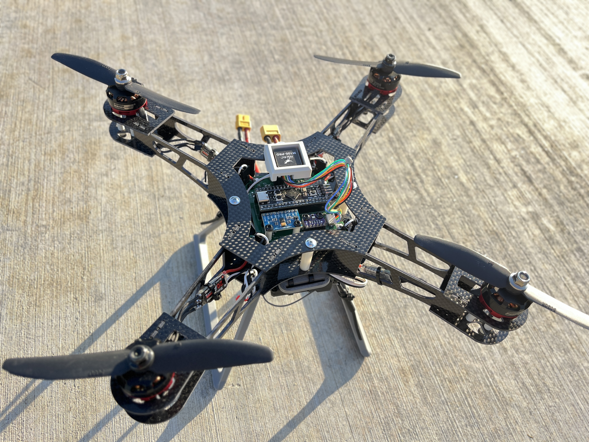 | 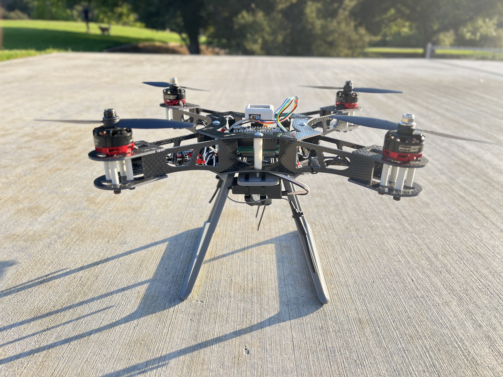 |
| --- | --- |

|  | 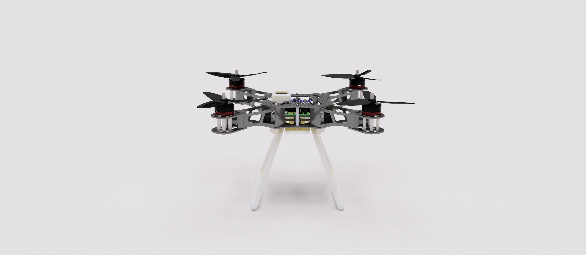 |
| --- | --- |

---

## Table of Contents

- [Introduction](#stm32-quadcopter-low-cost-quadcopter-design)
- [Frame](#frame)
  - [CF Components](#cf-components)
  - [ABS Components](#abs-components)
  - [Mechanical Components BOM](#mechanical-components-bom)
- [Electronics](#electronics)
  - [Electronics BOM](#electronics-bom)
  - [SMD Components](#smd-components)
  - [Pins](#pins)
  - [Sample Diagram](#sample-diagram)
  - [GPS (UART1) Wiring](#gps-uart1-wiring)
  - [Capacitor for Spike Filtering](#capacitor-for-spike-filtering)
- [Firmware](#firmware)
  - [Build](#build)
    - [Prerequisites](#prerequisites)
    - [Clone INAV](#clone-inav)
    - [Add Target](#add-target)
    - [Patch Code](#patch-code)
    - [Build](#build-1)
  - [Flash](#flash)
  - [MPU9250 Issue](#mpu9250-issue)
- [Configuration and Setting Up](#configuration-and-setting-up)

---

## Frame

Use the assembled CAD model in the `3.Models/` folder as a reference to build.

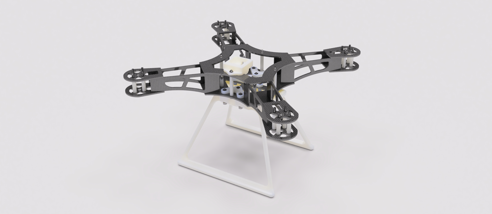

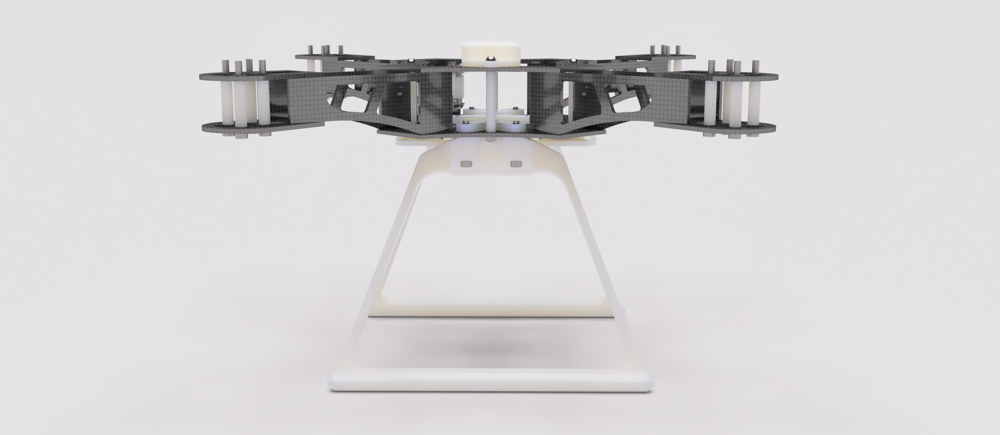

### CF Components


*All files are under `3.Models/`. Add dogbones and tolerances for manufacturability.*

### ABS Components

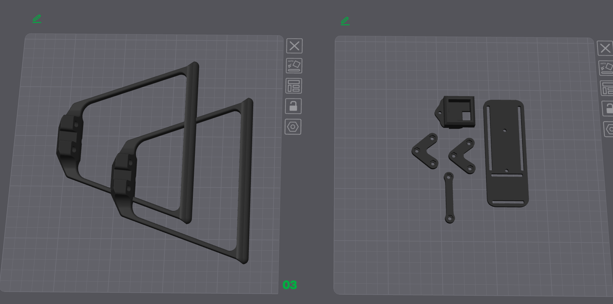

*Recommend using a 0.4 mm or 0.6 mm high-strength print profile.*

**Mechanical Components BOM**

| Item Name                   | Qty |
|----------------------------|-----|
| M3 Hex Nut                 | 19  |
| M3 x 12mm Button Head Bolt | 2   |
| M3 x 20mm Button Head Bolt | 7   |
| M3 x 20mm Socket Head Bolt | 6   |
| M3 x 30mm Socket Head Bolt | 16  |
| M3 x 35mm Button Head Bolt | 3   |
| M3 x 40mm Button Head Bolt | 1   |
| Nylon Spacer 3-5-11.2            | 8   |
| Nylon Spacer 3-5-20              | 16  |
| Nylon Spacer 3-5-30              | 4   |
| Nylon Spacer 3-5-5               | 2   |


---
## Electronics

**Structure**
```text
1. Electronics/
  ├── Extra/
  │   ├── *.step
  │   └── ...
  ├── Hardware-backups/
  │   └── ...
  ├── Production/           ← Gerber output for fabrication
  │   ├── Hardware-B_Cu.gbl
  │   └── ...
  ├── Hardware.kicad_pcb    ← KiCAD PCB file
  ├── Hardware.kicad_sch    ← KiCAD Schematics file
  ├── Hardware.kicad_pro    ← KiCAD project
  ├── JLCPCB.kicad_dru      ← Rules for JLCPCB manufacturing
  ├── Production.zip        ← Gerber
  └── Schematics.pdf        ← Schematics
```

### Electronics BOM

| Component                        | Qty |
|----------------------------------|:---:|
| RS2205 BLDC Motor                | 4   |
| BLHeli_S 20A ESC                 | 4   |
| 5030R Propeller                  | 2   |
| STM32F411CEU6 “Blackpill”            | 1   |
| MPU6500 / MPU9250 Module            | 1   |
| BMP280 Module        | 1   |
| 330 µF @ 50 V Capacitor           | 1   |
| FS-iA6B Receiver                 | 1   |
| FS-iA6B Transmitter              | 1   |
| Ovonic 1500 mAh 120C 3s Battery | 1   |
| XT60 Connector                   | 1   |

### SMD Components

Gerber files and BOM are available under the electronics folder.

### Pins

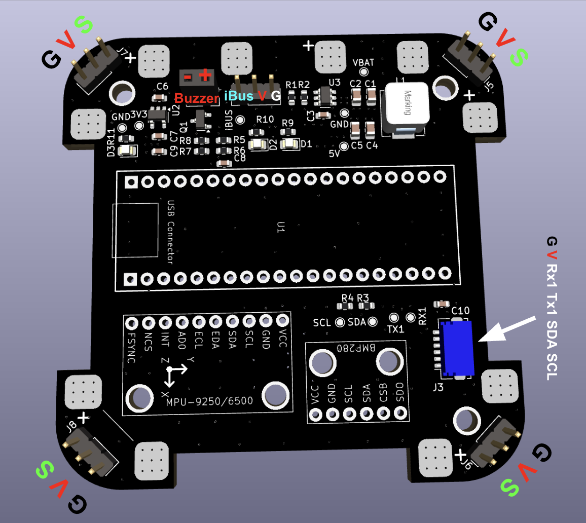

### Sample Diagram

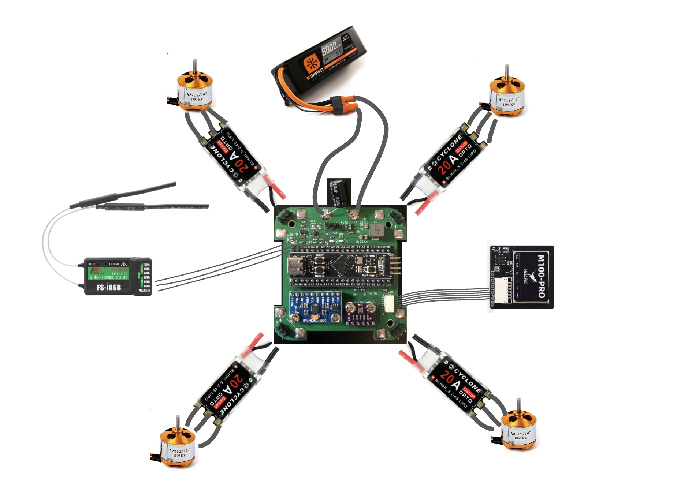

*Diagram only; not actual wiring. Please follow the strict pin assignments.*

### GPS (UART1) Wiring

Ensure connectors are wired correctly according to the pinout. Note that RX should connect to TX: `RX1` → GPS `TX`, `TX1` → GPS `RX`.


### Capacitor for Spike Filtering

One or more bulk electrolytic capacitor is recommended to protect against voltage spikes. Use an electrolytic capacitor such as **330 µF @ 50 V** and place it between `VBAT` and `GND` near the input. For extra protection, a **TVS diode** clampeing at ~**12 V** is ideal.

---
## Firmware

### Build

The firmware used is **INAV v6.0.0 ([github link](https://github.com/iNavFlight/inav))**. This project does not support **INAV v7+** currently due to USB issue. If one wants to modify the target file or other configurations of the firmware, they must rebuild the binary. Follow this guide to build:

**Prerequisites**
- CMake ≥ 3.15  
- Ninja  
- gcc-arm-none-eabi toolchain 

**Clone INAV**
```shell
git clone https://github.com/iNavFlight/inav.git
cd inav
git checkout 6.0
```

**Add Target**

Copy the entire `2.Firmware/GYW_BLACKPILL_F411` folder into the local INAV repository under `src/main/target/` so that it ends up as:

```text
inav/
└── src/
    └── main/
        └── target/
            ├──  GYW_BLACKPILL_F411/
            └── ...
```

**Patch Code**

INAV 6.0 doesn’t support a **25 MHz HSE clock** by default, so if your board (like the **Blackpill F411**) uses a 25 MHz crystal, you must update the PLL setup in `src/main/target/system_stm32f4xx.c` as follows:

In `system_stm32f4xx.c`, locate the PLL setup region and modify it as follows:
```diff
#if defined(STM32F40_41xxx) || defined(STM32F427_437xx) || defined(STM32F429_439xx) || defined(STM32F401xx) || defined(STM32F469_479xx) || defined(STM32F446xx) || defined(STM32F410xx) || defined(STM32F411xE)
+   #if HSE_VALUE == 25000000
+       #define PLL_M   25
+   #elif HSE_VALUE == 24000000
-   #if HSE_VALUE == 24000000
        #define PLL_M   24
    #elif HSE_VALUE == 16000000
        #define PLL_M   16
    #elif HSE_VALUE == 8000000
        #define PLL_M   8
    #else
        #error Invalid HSE_VALUE
    #endif
#else
    #error Undefined CPU
#endif
```

**Build**

Ensure that you have installed all dependencies. Inside the inav root repository execute:
```shell
mkdir -p build && cd build
cmake .. -G Ninja \
  -DBOARD=GYW_BLACKPILL_F411 \
  -DCMAKE_TOOLCHAIN_FILE=../tools/cmake/toolchain-arm-none-eabi.cmake
ninja
```

The firmware binary should be at `build/inav_6.0.0_GYW_BLACKPILL_F411.hex`.


### Flash

First, download the **INAV Configurator v6.0.0** from [this link](https://github.com/iNavFlight/inav-configurator/releases/tag/6.0.0). Once installed, launch INAV Configurator and connect to the Blackpill via USB. Cut the **red wire** in the USB cable to prevent it from powering the Blackpill. Instead, power the flight controller using an external **3S battery**.


<div style="text-align: center;">
  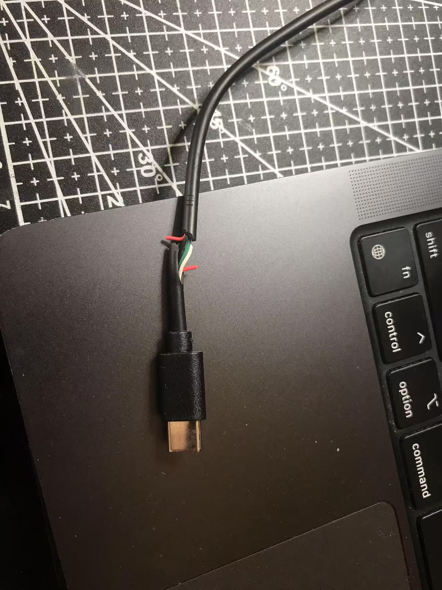
</div>

To enter DFU mode, hold the **BOOT** button on the Blackpill while powering it on. Alternatively, you can press **RESET** while holding the BOOT button. When in DFU mode, the blue LED on the Blackpill will be off, and the board should appear in the INAV Configurator’s drop-down menu as a DFU device. Move to the **Firmware Flasher** tab on the left. Click **Load Firmware**, select the file `inav_6.0.0_GYW_BLACKPILL_F411.hex` (found in the `firmware` folder), then click **Flash Firmware**.


<div style="text-align: center;">
  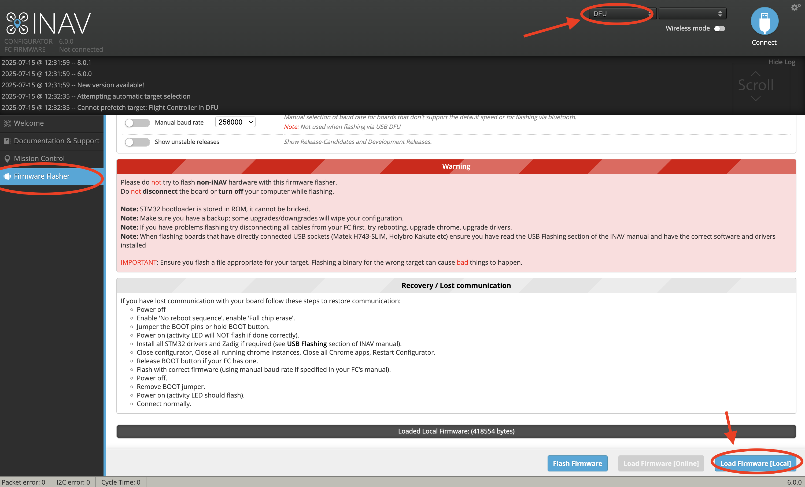
</div>

A progress bar will appear during firmware flash.

<div style="text-align: center;">
  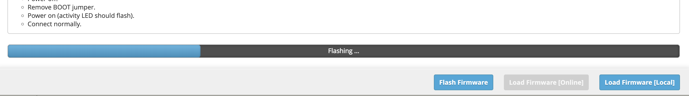
</div>

When the firmware is successfully flashed, click connect. The configuration menu should show up. 
<div style="text-align: center;">
  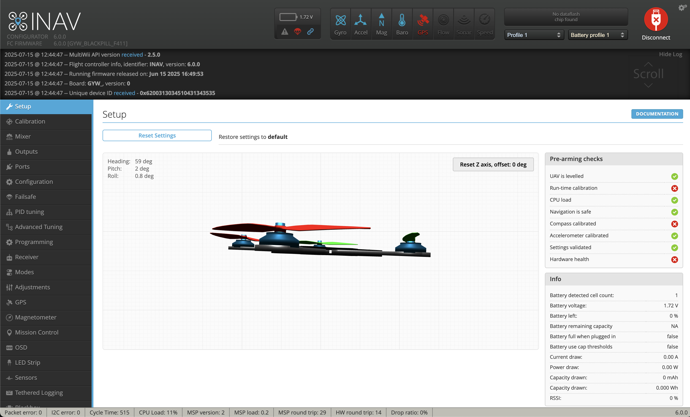
</div>


### MPU9250 Issue

If you are using a MPU9250 module, you may encounter the problem that INAV does not recognize the accelerometer. This is due to many boards labeled MPU9250 actually house only an **MPU6500** (omitting or substituting the magnetometer). Since drones often use an external magnetometer, this usually isn’t critical if your accelerometer and gyro (MPU6500) work. 

To identify your chip, read the `WHO_AM_I` register (`0x75`) via I²C (use an Arduino or something similar to do this part). Example Arduino code:
```cpp
#include <Wire.h>
const uint8_t MPU_ADDR     = 0x68; // I²C address
const uint8_t WHO_AM_I_REG = 0x75;
void setup() {
  Serial.begin(115200);
  Wire.begin();
  delay(100);
  Wire.beginTransmission(MPU_ADDR);
  Wire.write(WHO_AM_I_REG);
  if (Wire.endTransmission(false) != 0) {
    Serial.println(F("no device found")); while (1);
  }
  Wire.requestFrom(MPU_ADDR, (uint8_t)1);
  if (Wire.available()) {
    uint8_t id = Wire.read();
    Serial.print(F("WHO_AM_I = 0x"));
    Serial.println(id, HEX);
  } else {
    Serial.println(F("no data returned"));
  }
}
```
If it prints `0x71`, it’s MPU6500; `0x73` indicates MPU9250. 

The current binary file and target is configured for **MPU6500**. To use MPU9250, comment out the block for MPU6500 and uncomment the MPU9250 block in the target file. Rebuild the binary and flash. It looks like this:

```c
#define USE_IMU_MPU9250
#define IMU_MPU9250_ALIGN   CW0_DEG
#define MPU9250_CS_PIN      PB12
#define MPU9250_SPI_BUS     BUS_SPI2
```

---
## Configuration and Setting Up

Follow standard inav configuration procedures. 

